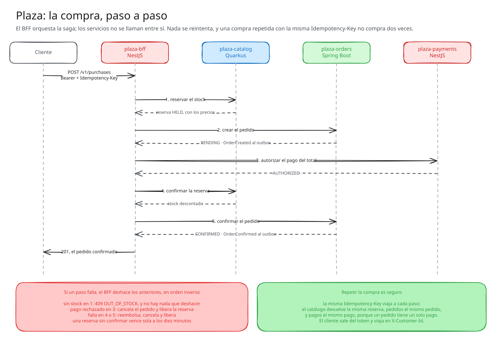
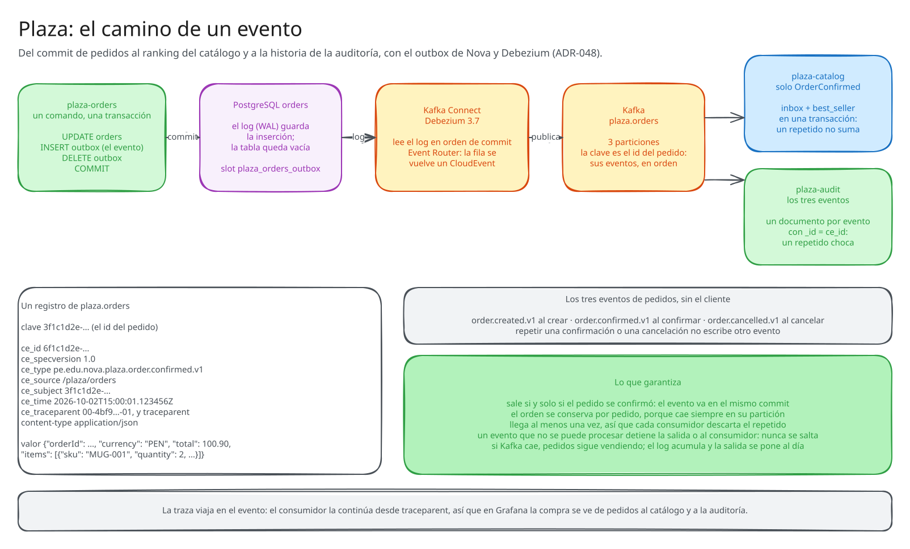

# Diagramas de Nova Platform

El estado del desarrollo de Nova en ocho diagramas: la plataforma entera, cada stack, una matriz de
capacidades y Plaza, el aplicativo que la demuestra. Están dibujados con
[Excalidraw](https://excalidraw.com) y reflejan las versiones publicadas al 2026-10-02.

| Diagrama | Qué muestra |
|---|---|
| [Panorama](#panorama) | los repositorios por stack y por nivel: los seis de [ADR-001](../adrs/shared/ADR-001-arquitectura-meta-framework-cinco-niveles.md) con la enmienda de [ADR-051](../adrs/shared/ADR-051-plantillas-de-servicio.md) |
| [Spring Boot](#spring-boot) | qué recibe un servicio Spring Boot y de dónde sale: el toolchain, el BOM, el meta-starter y los ocho starters con su núcleo |
| [Quarkus](#quarkus) | lo mismo en Quarkus: las extensiones y los núcleos puros que un servicio usa directo |
| [NestJS](#nestjs) | el monorepo, sus cinco paquetes, el perfil de UTP y quién los usa |
| [Capacidades](#capacidades) | cada capacidad transversal en los tres stacks: hecha, parcial, pendiente o propuesta |
| [Plaza: el aplicativo](#plaza-el-aplicativo) | los seis servicios de [ADR-043](../adrs/shared/ADR-043-plaza-la-plataforma-de-compras.md), sus bases, Keycloak, Vault, Kafka con Debezium y la observabilidad |
| [Plaza: la compra](#plaza-la-compra) | la saga que orquesta el BFF, paso a paso, con sus compensaciones |
| [Plaza: un evento](#plaza-un-evento) | el camino de un evento de pedidos, del outbox al ranking y a la auditoría ([ADR-048](../adrs/shared/ADR-048-outbox-transaccional-detras-de-un-contrato.md)) |

En todos, **un borde sólido es algo que existe hoy y un borde punteado es algo planeado o sin
código**. En los de Plaza, el color dice el framework: rojo NestJS, verde Spring Boot y azul Quarkus.

## Panorama


## Spring Boot


## Quarkus


## NestJS


## Capacidades


## Plaza: el aplicativo


## Plaza: la compra



## Plaza: un evento



## Cómo se actualizan

Cada diagrama tiene tres archivos:

| Archivo | Para qué |
|---|---|
| `NN-nombre.excalidraw` | la escena editable: se abre en excalidraw.com con *Open* |
| `NN-nombre.svg` | lo que muestra este README, con la fuente incrustada |
| `src/NN-nombre.json` | la fuente: los elementos en el formato de esqueleto de Excalidraw, con las etiquetas dentro de cada figura |

**Un cambio chico se hace en excalidraw.com.** Se abre el `.excalidraw`, se edita, se guarda encima
y se exporta el SVG con *Export image* → *SVG*, con *Embed scene* apagado. En ese caso `src/` queda
atrás: conviene corregir también el JSON, o el próximo regenerado deshace el cambio.

**Un cambio de contenido se hace en `src/`** y se regenera. `tools/export.mjs` corre la propia
librería de Excalidraw en un Edge sin ventana: convierte el esqueleto, escribe el `.excalidraw` y el
`.svg`, y deja una vista previa en PNG para revisar el resultado antes de subirlo.

```bash
cd diagrams
node tools/gen-matrix.mjs
node tools/export.mjs src/05-capacidades.json 05-capacidades
```

La matriz se genera con `tools/gen-matrix.mjs`, porque son 72 celdas y a mano es fácil
desalinearlas: el estado de cada capacidad se cambia ahí. El script de exportación pide Node 24 y
Microsoft Edge, y descarga Excalidraw 0.18.0 de esm.sh. Los `*.preview.png` no se versionan.

**Cuándo.** Un diagrama se actualiza en el mismo PR que cambia lo que muestra: una versión
publicada, una capacidad que se completa o un repositorio nuevo. Así no se queda atrás.
